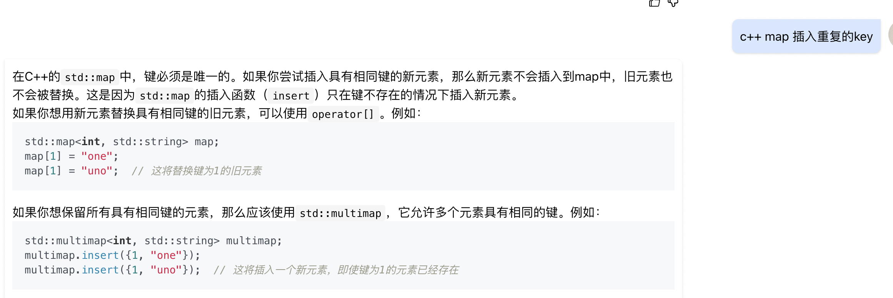
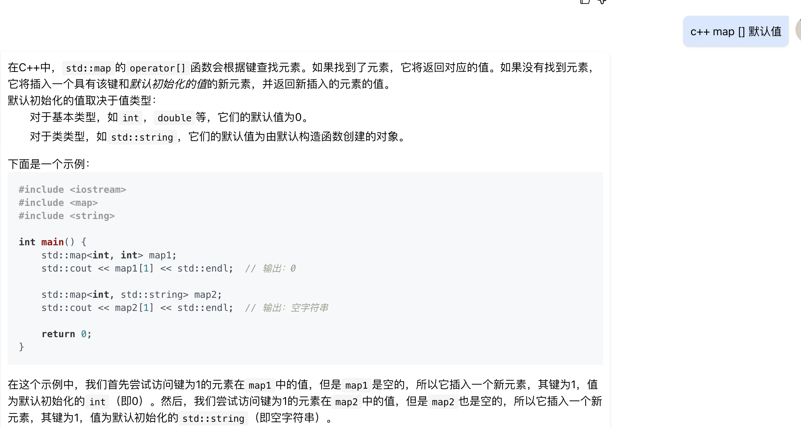
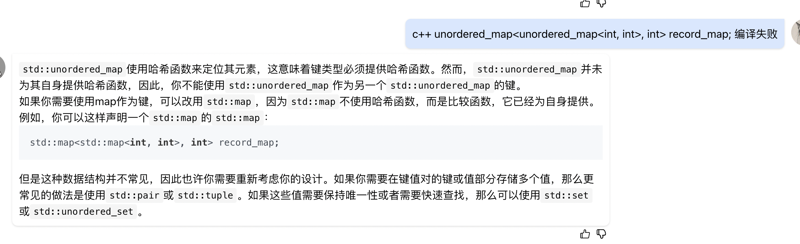

/**
 * struct Point {
 *	int x;
 *	int y;
 * };
 */

#include <algorithm>
#include <type_traits>
class Solution {
public:
    /**
     * 
     * @param points Point类vector 
     * @return int整型
     */
    int maxPoints(vector<Point>& points) {
        // write code here
        if(points.size() <= 2){
            return points.size();
        }
        int res = 0;
        map<pair<int, int>, int> record_map;
        for(int i = 0; i < points.size(); i++) {
            int max = 0, dup = 1;
            for(int j = i + 1; j < points.size(); j++){
                int deta_x = points[i].x - points[j].x;
                int deta_y = points[i].y - points[j].y;
                if(deta_x == 0 && deta_y == 0){
                    dup++;
                }else{
                    int mgy = get_max_gongyue(deta_x, deta_y);
                    record_map[{deta_x / mgy, deta_y / mgy}]++;
                    max = std::max(max, record_map[{deta_x / mgy, deta_y / mgy}]);
                }
            }
            record_map.clear();
            res = std::max(res, max + dup);
        }
        return res;
    }

    int get_max_gongyue(int x, int y){
        return y == 0 ? x : get_max_gongyue(y, x % y);
    }
};

--------

---------
辗转相除法求最大公约数

    int get_max_gongyue(int x, int y){
        return y == 0 ? x : get_max_gongyue(y, x % y);
    }

---------
