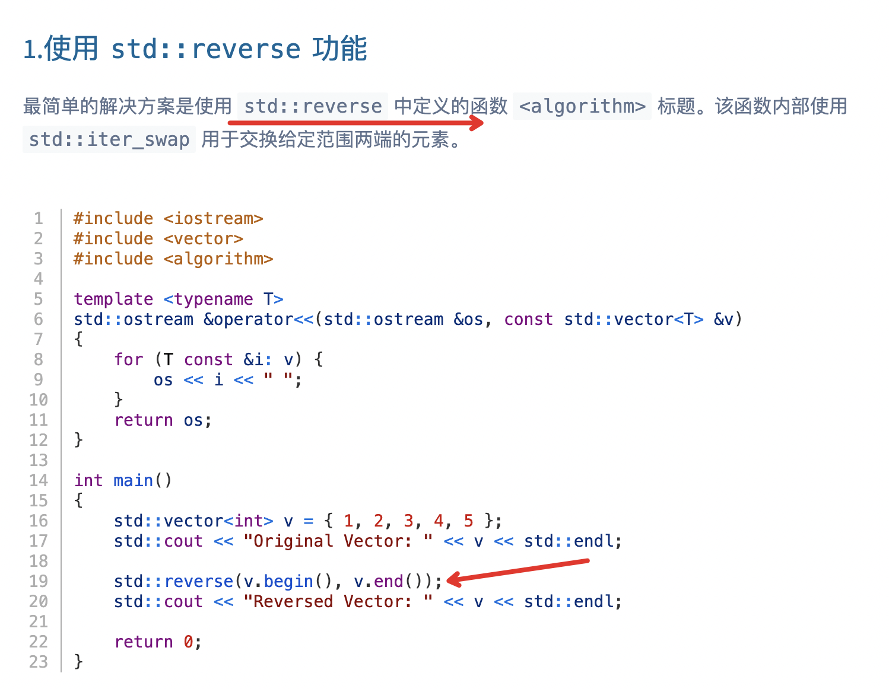

/**
 * struct TreeNode {
 *	int val;
 *	struct TreeNode *left;
 *	struct TreeNode *right;
 * };
 */

class Solution {
public:
    /**
     * 
     * @param root TreeNode类 
     * @return int整型vector
     */
    vector<int> vec;
    vector<int> postorderTraversal(TreeNode* root) {
        // write code here
        if(root == nullptr){
            return vec;
        }
        postorderTraversal(root->left);
        postorderTraversal(root->right);
        vec.push_back(root->val);
        return vec;
    }
};

--------
* 用栈来实现
#include <algorithm>
#include <stack>
#include <vector>
/**
 * struct TreeNode {
 *	int val;
 *	struct TreeNode *left;
 *	struct TreeNode *right;
 * };
 */

class Solution {
public:
    /**
     * 
     * @param root TreeNode类 
     * @return int整型vector
     */
    vector<int> postorderTraversal(TreeNode* root) {
        // write code here
        vector<int> vec;
        if(root == nullptr){
            return vec;
        }
        stack<TreeNode*> stk;
        stk.push(root);
        while(!stk.empty()){
            TreeNode* node = stk.top();
            stk.pop();
            vec.push_back(node->val);
            if(node->left != nullptr){
                stk.push(node->left);
            }
            if(node->right != nullptr){
                stk.push(node->right);
            }
        }
        std::reverse(vec.begin(), vec.end());
        return vec;
    }
};

---------
* c++ 反转vector
