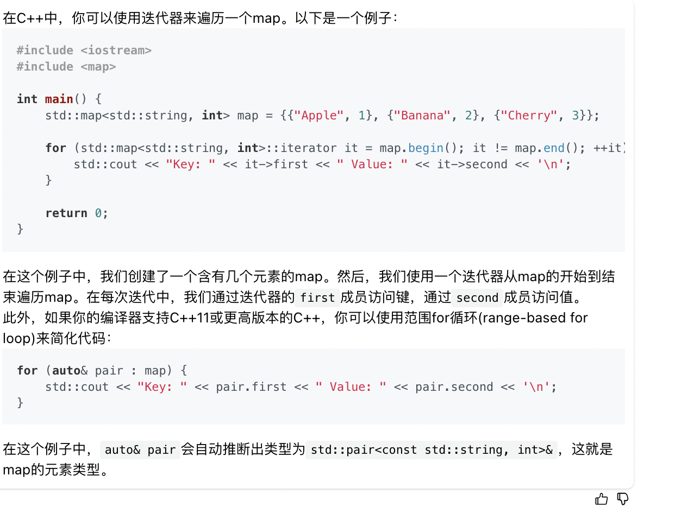
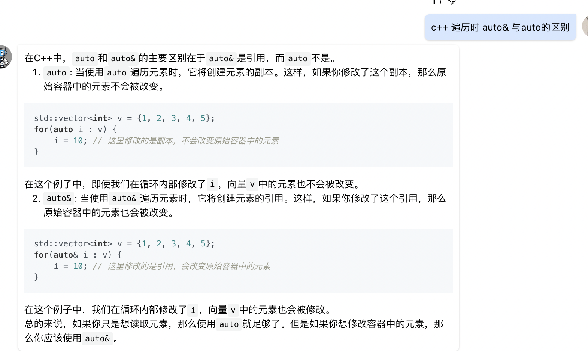

```
/**
 * Definition for undirected graph.
 * struct UndirectedGraphNode {
 *     int label;
 *     vector<UndirectedGraphNode *> neighbors;
 *     UndirectedGraphNode(int x) : label(x) {};
 * };
 */
class Solution {
public:
    UndirectedGraphNode *cloneGraph(UndirectedGraphNode *node) {
        if(node == nullptr) {
            return nullptr;
        }
        map<UndirectedGraphNode *, UndirectedGraphNode *> m;
        DFS(node, m);

        for(auto& pair : m){
            UndirectedGraphNode* old_node = pair.first;
            UndirectedGraphNode* new_node = pair.second;
            for(auto neighbor : old_node->neighbors){
                new_node->neighbors.push_back(m[neighbor]);
            }
        }
        return m[node];
    }

    void DFS(UndirectedGraphNode* node, map<UndirectedGraphNode *, UndirectedGraphNode *>& m) {
        if(node == nullptr || m.find(node) != m.end()) {
            return ;
        } 
        UndirectedGraphNode* old_node = new UndirectedGraphNode(node->label);
        m[node] = old_node;
        for(auto neighbor : node->neighbors) {
            DFS(neighbor, m);
        }
    }
};
```

* 如何遍历一个map


* 遍历元素时，auto和auto&的区别
