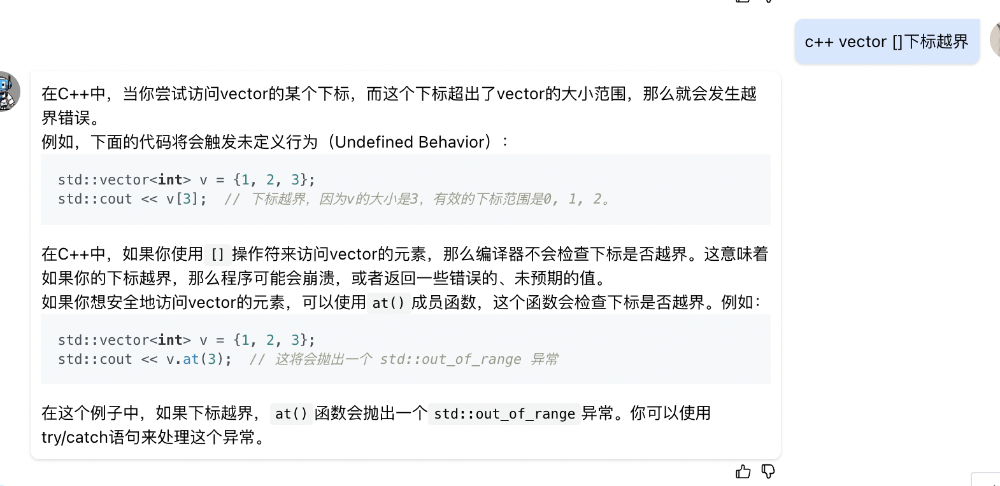
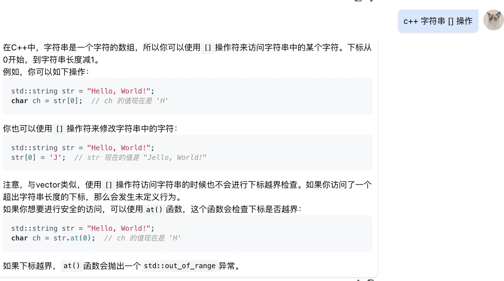

#include <vector>
#include <algorithm>
class Solution {
public:
    /**
     * 
     * @param s string字符串 
     * @return int整型
     */
    //dp[i]等于min{dp[最近一次分割点的下标] + 1}
    int minCut(string s) {
        // write code here
        vector<int> dp(s.length());
        for(int i = 0; i < dp.size(); i++) {
            dp[i] = i;
        }
        for(int i = 1; i < s.length(); i++) {
            if(is_huiwen(s.substr(0,i + 1))){
                dp[i] = 0;
                continue;
            }
            for(int j = 0; j < i; j++) {
                if(is_huiwen(s.substr(j + 1, i - j))){
                    dp[i] = min(dp[i], dp[j] + 1);
                }
            }
        }
        return dp[s.length() - 1];
    }

    bool is_huiwen(string s) {
        int l_index = 0;
        int r_index = s.size() - 1;
        while(l_index <= r_index) {
            if(s[l_index] != s[r_index]) {
                return false;
            }
            l_index++; r_index--;
        }
        return true;
    }
};

* 注意substr的下标，很绕

* vector的[]下标越界不会抛异常，小心
  

* string的[] 下标越界也不会抛异常，小心
