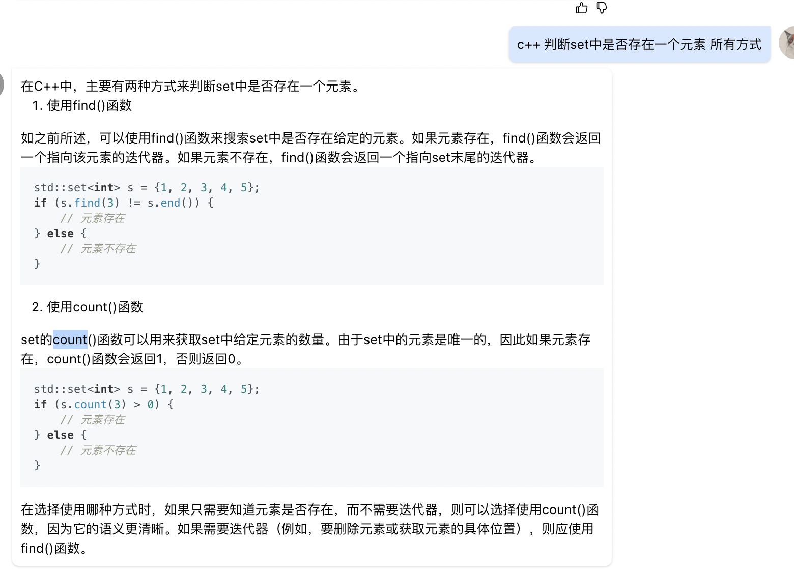

```


#include <unordered_map>
class Solution {
public:
    /**
     * 
     * @param num int整型vector 
     * @return int整型
     */
    int longestConsecutive(vector<int>& num) {
        unordered_set<int> num_set;
        for(auto n : num) {
            num_set.insert(n);
        }
        int res = 0;
        for(auto n : num) {
            if(num_set.find(n) == num_set.end()) {
                continue;
            }
            num_set.erase(n);
            int len = 1;
            int l_num = n - 1;
            int r_num = n + 1;
            while(num_set.find(l_num) != num_set.end()){
                num_set.erase(l_num);
                l_num--;
                len++;
            }
            while(num_set.find(r_num) != num_set.end()){
                num_set.erase(r_num);
                r_num++;
                len++;
            }            
            res = max(res, len);
        }
        return res;
    }
};
```

* set有个count函数也可以用来判断元素是否存在
