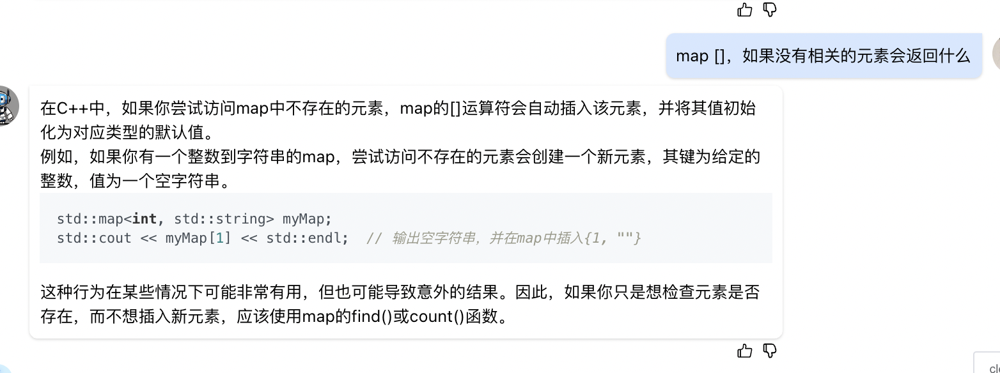

```
//BFS求最短路径三件套：queue、路径长度、visited

#include <iterator>
#include <queue>
class Solution {
public:
    //BFS 求最短路径
    int ladderLength(string start, string end, unordered_set<string> &dict) {
        dict.insert(end);
        queue<string> neighbors;
        int len = 1;
        neighbors.push(start);
        dict.erase(start);
        while(neighbors.size() > 0) {
            int size = neighbors.size();
            for(int i = 0; i < size; i++) {
                string current_str = neighbors.front();
                neighbors.pop();
                if(current_str == end) {
                    return len;
                }
                for(auto it = dict.begin(); it != dict.end(); ) {
                    if(can_change(*it, current_str)) {
                        neighbors.push(*it);
                        it = dict.erase(it);
                    }else {
                        it++;
                    }
                }
            }
            len++;
        }
        return 0;
    }

    bool can_change(const string& a,const string& b) {
        if(a.length() != b.length()) {
            return false;
        }
        int diff_num = 0;
        for(int i = 0; i < a.length(); i++) {
            if(a[i] != b[i]) {
                diff_num ++;
            }
        }
        return diff_num == 1;
    }
};
```

* set遍历时删除数据
```
    for(auto it = dict.begin(); it != dict.end(); ) {
        if(can_change(*it, current_str)) {
            neighbors.push(*it);
            it = dict.erase(it);
        }else {
            it++;
        }
    }
```

* map下标访问元素，注意不存在时会以默认值插入。

