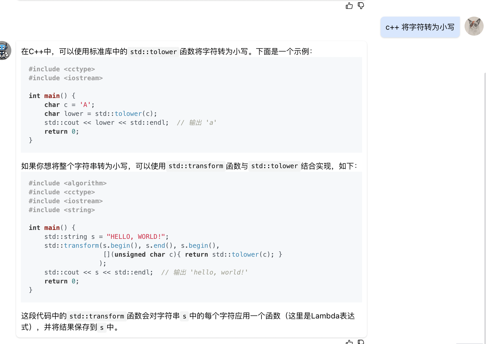

* 解法1
```
#include <cctype>
class Solution {
public:
    /**
     * 
     * @param s string字符串 
     * @return bool布尔型
     */
    bool isPalindrome(string s) {
        // write code here
        string formated_str;
        for(int i = 0; i < s.size(); i++) {
            if(isOK(s[i])){
                formated_str += s[i];
            }
        }
        return isPalindrome_(formated_str);
    }
    bool isOK(char c){
        return ('0' <= c && c<= '9') || ('a' <= c && c <= 'z') || ('A' <= c && c<= 'Z');
    }
    bool isPalindrome_(string& str) {
        int l_index = 0;
        int r_index = str.size() - 1;
        while(l_index <= r_index){
            if(tolower(str[l_index]) != tolower(str[r_index])){
                return false;
            }
            l_index++;
            r_index--;
        }
        return true;
    }
};


```

* 解法2

```
#include <cctype>
class Solution {
public:
    /**
     * 
     * @param s string字符串 
     * @return bool布尔型
     */
    bool isPalindrome(string s) {
        // write code here
        int l_index = 0;
        int r_index = s.size() - 1;
        while(r_index > l_index) { //这里不能写成 >=
            while(r_index > l_index && !isOK(s[l_index])){
                l_index++;
            }
            while(r_index > l_index && !isOK(s[r_index])){
                r_index--;
            }
            if(r_index < l_index) {
                return false;
            }
            if(tolower(s[l_index]) != tolower(s[r_index])){
                return false;
            }
            r_index--; l_index++;
        }
        return true;
    }
    bool isOK(char c){
        return ('0' <= c && c<= '9') || ('a' <= c && c <= 'z') || ('A' <= c && c<= 'Z');
    }
};
```

* 解法1 思路更明确，解法2有些细节，更绕，个人倾向于解法1

* c++ 字符转为小写/ 大写


* c++ string 直接append 字符串会发生什么动作
    a. 判断当前的字符缓冲区是否还能容纳append的字符串
       i. 可以，直接append
       ii. 不可以，重新分配缓冲区，然后将字符串拷贝到信缓冲区append，释放旧缓冲区 

* c++ stringstream为什么更加高效


* c++ string可以使用 += 直接append字符或者字符串