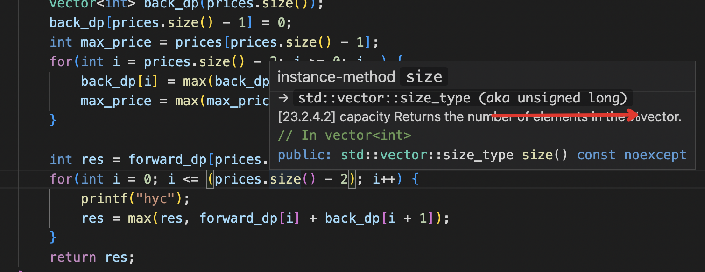

```
* 一次交易的变种，从前从后各扫描一次


#include <cstdio>
class Solution {
public:
    /**
     * 
     * @param prices int整型vector 
     * @return int整型
     */
     //两次dp，然后遍历
    int maxProfit(vector<int>& prices) {
        if(prices.size() < 2) {
            return 0;
        }
        // write code here
        vector<int> forward_dp(prices.size());
        forward_dp[0] = 0;
        int min_price = prices[0];
        for(int i = 1; i < prices.size(); i++) {
            forward_dp[i] = max(forward_dp[i-1], prices[i] - min_price);
            min_price = min(min_price, prices[i]);
        }

        vector<int> back_dp(prices.size());
        back_dp[prices.size() - 1] = 0;
        int max_price = prices[prices.size() - 1];
        for(int i = prices.size() - 2; i >= 0; i--) {
            back_dp[i] = max(back_dp[i + 1], max_price - prices[i]);
            max_price = max(max_price, prices[i]);
        }
        
        int res = forward_dp[prices.size() - 1];// 这一行不写也行
        for(int i = 0; i <= (prices.size() - 2); i++) { // 这里写成i <= prices.size() - 3 会堆栈溢出
            printf("hyc");
            res = max(res, forward_dp[i] + back_dp[i + 1]); 
        }
        return res;
    }
};
```

*  vector.size()返回的是无符号数, 慎用( vector.size() - x ) 操作
