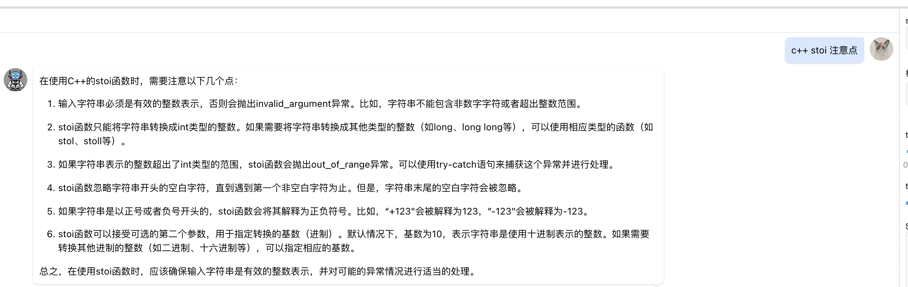

```
#include <cstdlib>
#include <string>
#include <vector>
class Solution {
public:
    /**
     * 代码中的类名、方法名、参数名已经指定，请勿修改，直接返回方法规定的值即可
     *
     * 
     * @param s string字符串 
     * @return string字符串vector
     */
    vector<string> restoreIpAddresses(string s) {
        // write code here
        vector<string> res;
        DFS(s, "", 0, res);
        return res;
    }

    void DFS(string s, string tmp_ip, int step_length, vector<string>& res) {
        if(step_length == 4) {
            if(s.empty()){
                res.push_back(tmp_ip);
            }
            return ;
        }

        for(int next_len = 1; next_len <= 3 && next_len <= s.size(); next_len++) {
            if(is_ip(s.substr(0, next_len))){
                string next_tmp_ip = "";
                if(step_length == 0){
                    next_tmp_ip = s.substr(0, next_len);
                }else {
                    next_tmp_ip = tmp_ip + "." + s.substr(0, next_len);
                }
                DFS(s.substr(next_len, s.size() - next_len), next_tmp_ip, step_length + 1, res);
            }
        }
    }

    bool is_ip(string str) {
         if(str.empty() || (str.size() > 1 && str[0] == '0')){
            return false;
         }
         return 0 <= stoi(str) && stoi(str) <= 255;
    }
};
```

* c++ 的stoi 注意点

