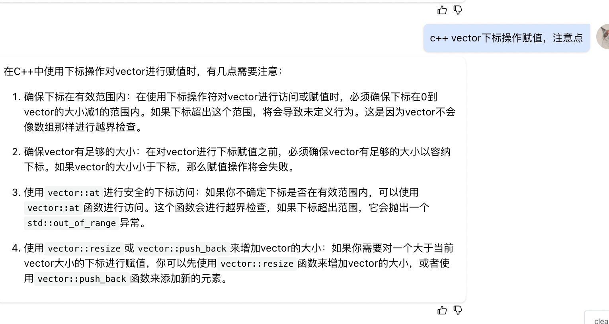

* leetcode065的变种
```

#include <cmath>
#include <cstdio>
#include <vector>

class Solution {
  public:
    int maximalRectangle(vector<vector<char> >& matrix) {
        if(matrix.empty()){
            return 0;
        }
        //vecto记得初始化范围，不然下标访问赋值会越界
        vector<vector<int>> heights(matrix.size(), vector<int>(matrix[0].size()));
        
        for (int row_index = 0; row_index < matrix.size(); row_index++) {
            for (int col_index = 0; col_index < matrix[row_index].size(); col_index++) {
               heights[row_index][col_index] = get_height(matrix, row_index, col_index);
            }
        }
        
        int res = 0;
        for(int row_index = 0; row_index < heights.size(); row_index++) {
            res = max(res, largestRectangleArea(heights[row_index]));
        }
        return res;
    }

    int get_height(vector<vector<char> >& matrix, int row_index, int col_index){
        int height = 0;
        while(row_index < matrix.size() && matrix[row_index][col_index] == '1') {
            height++;
            row_index++;
        }
        return height;
    }

    int largestRectangleArea(vector<int>& height) {
        // write code here
        int res = 0;
        for(int i = 0; i < height.size(); i++) {
            int h = height[i];
            int back_index = i + 1;
            int front_index = i - 1;
            while(front_index >= 0 && height[front_index] >= h) {
                front_index--;
            }
            while(back_index < height.size() && height[back_index] >= h) {
                back_index++;
            }
            
            int w = back_index - front_index - 1;
            res = max(res, h * w);
        }
        return res;
    }
};

```

* c++ vector下标操作赋值，注意点
