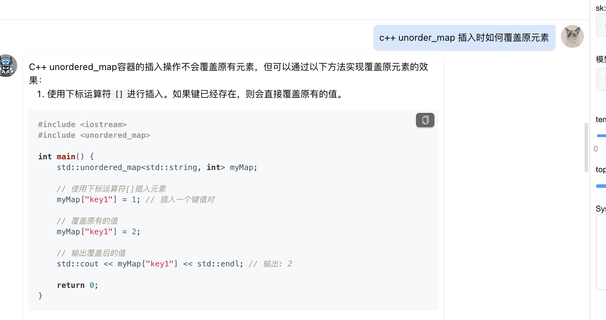
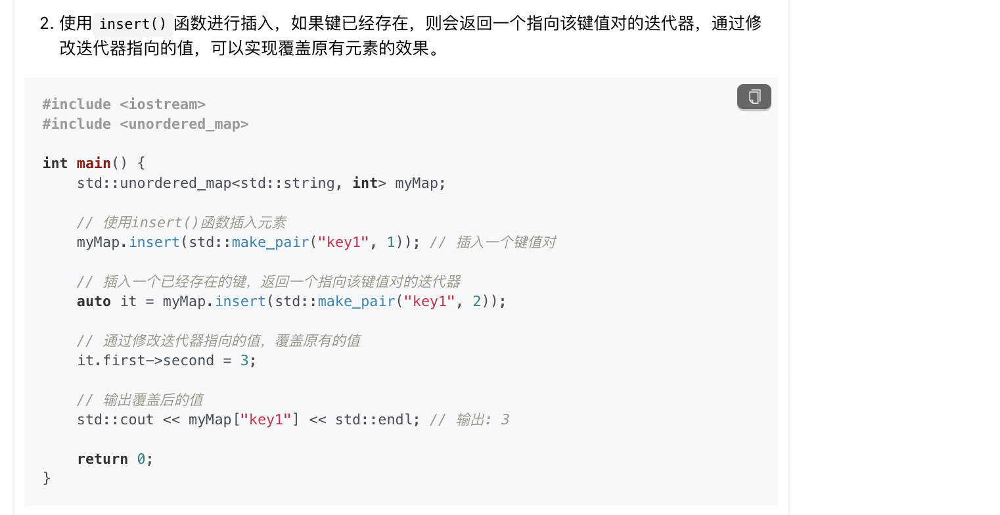
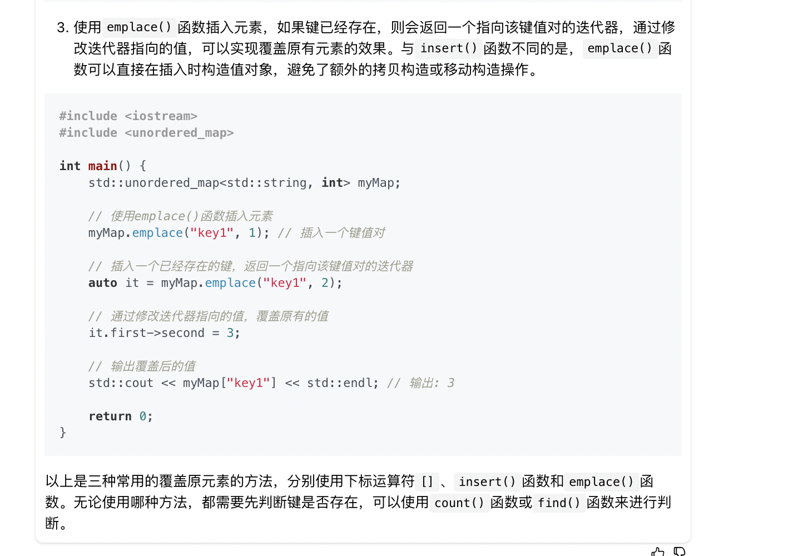
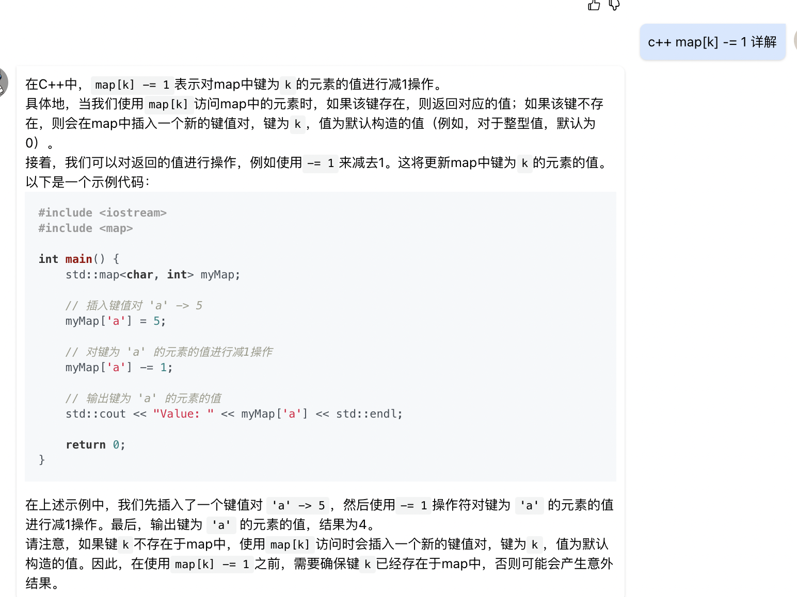
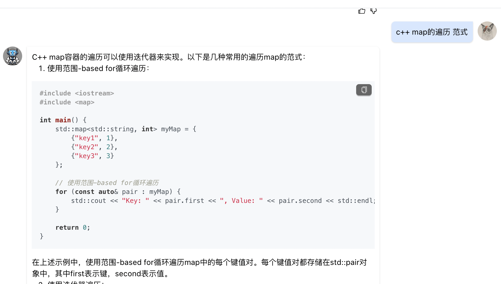
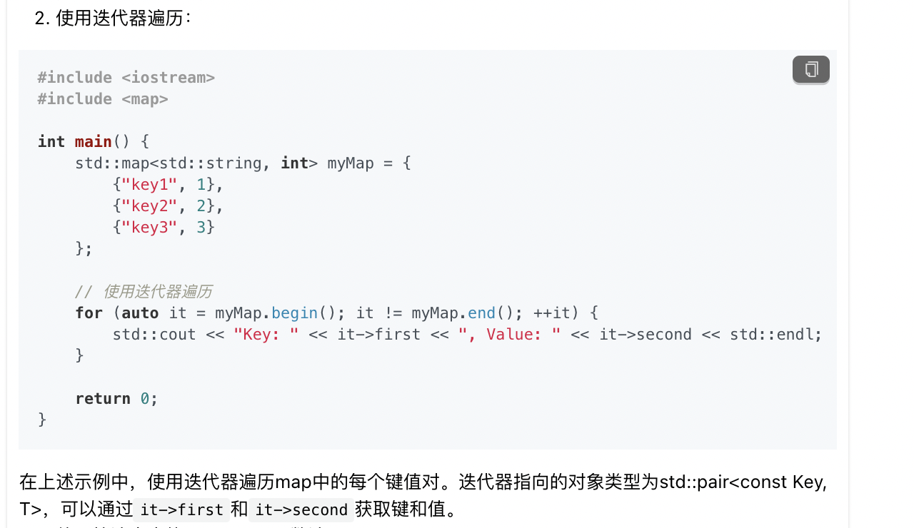
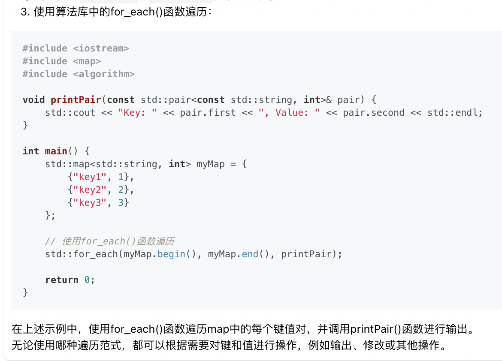
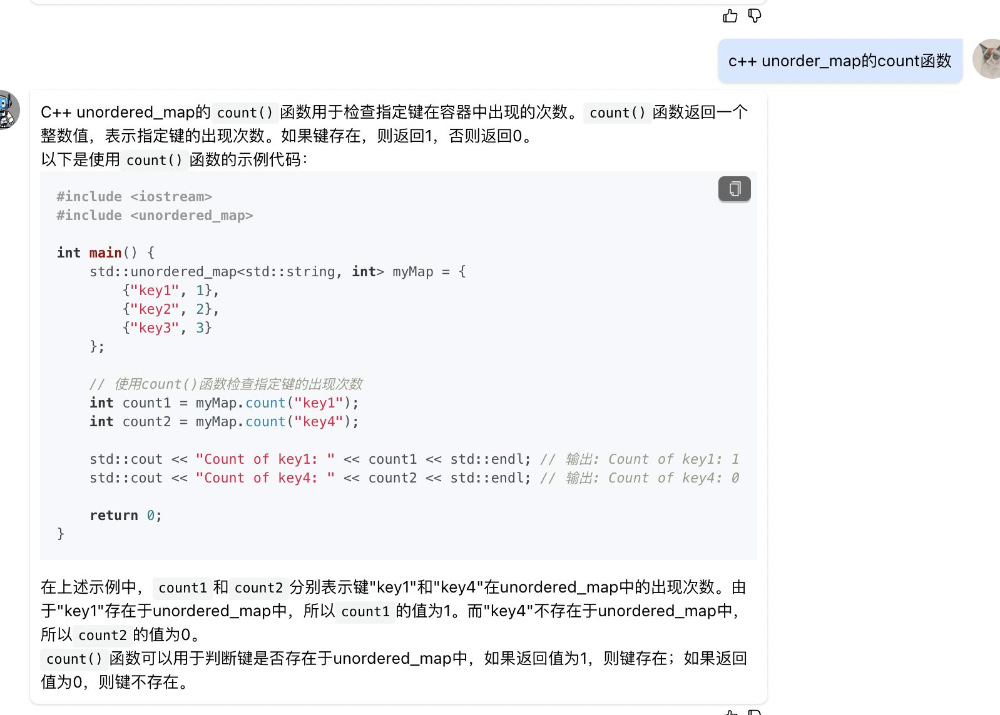

```
#include <climits>
#include <unordered_map>
class Solution {
public:
    
    bool check(unordered_map<char, int>& hash) {
        for(const auto& pair : hash) {
            if(pair.second < 0) {
                return false;
            }
        }
        return true;
    }

    string minWindow(string S, string T) {
        unordered_map<char, int> hash;
        for(auto c : T) {
            hash[c]  -= 1;
        }
        
        //闭区间
        int left = 0;
        int right = 0;
        int min_len = INT_MAX;
        
        int final_left = -1;
        int final_right = -1;
        while(right < S.size()) {
            char c = S[right];
            if(hash.count(c)){
                hash[c]++;
            }
            while(check(hash)) {
                //更新结果
                if(right - left < min_len){
                    min_len = right - left;
                    final_left = left;
                    final_right = right;
                }
                //更新统计数据
                char c = S[left];
                if(hash.count(c)){
                    hash[c]--;
                }
                left++;
            }
            right++;
        }
        return final_left == -1 ? "" : S.substr(final_left, final_right - final_left + 1);

    }
};
```
* c++ map不支持覆盖，如何可以覆盖




* c++ map[k] -= 1 这行代码的含义


* 如何遍历map




* c++ map的count函数
